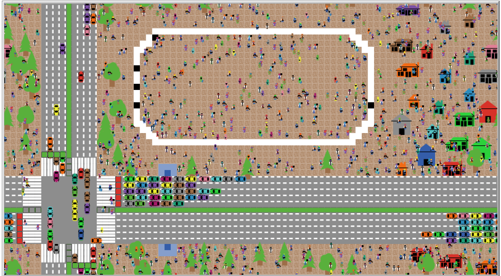

# Traffic Simulation at Taipei Dome Area with NetLogo

### Overview
This project presents a simplified traffic flow simulation focused on the Taipei Dome Area. Using the NetLogo environment, this model aims to simulate and analyze traffic dynamics under various scenarios.

### Framework
Below is the framework of the simulation:

### How to Use
1. Download the `traffic.nlogo` file.
2. Open the NetLogo environment on your machine.
3. Load the `traffic.nlogo` file into NetLogo.
4. Initialize the model and run the simulation.

### Requirements
This simulation is developed in NetLogo. To run it, you need:
- [NetLogo](https://ccl.northwestern.edu/netlogo/) installed on your system.

### Installation
No special installation is required. Simply:
1. Download the `Code/geo_sim_final3.asc` file.
2. Load it into the NetLogo environment as the input dataset for the simulation.

### Author
Created and maintained by [Buffett Liu](https://github.com/buffett0323).

For inquiries or contributions, feel free to reach out or submit issues to the repository.

